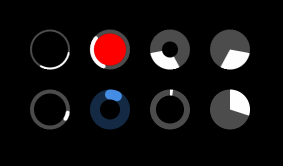

## RPCircularProgress

[](https://coveralls.io/github/iwasrobbed/RPCircularProgress?branch=master)
[](https://travis-ci.org/iwasrobbed/RPCircularProgress)

UIView subclass written in Swift to show circular progress. 



Is your app using it? [Let me know!](mailto:rob@desideratalabs.co)

Please see the included example app for sample usage.

### Styles:

* Indeterminate (spins infinitely)
* Normal (set progress between 0.0 and 1.0)
* Mixed (can make it indeterminate, but also animate progress to 1.0)

### Public API

```swift
/**
 Enables or disables the indeterminate (spinning) animation

 - parameter enabled:    Whether or not to enable the animation (defaults to `true`)
 - parameter completion: An optional closure to execute after the animation completes
 */
func enableIndeterminate(enabled: Bool = true, completion: CompletionBlock? = nil) {}
```

```swift
/**
 Updates the progress bar to the given value with the optional properties

 - parameter progress:     The progress to update to, pinned between `0` and `1`
 - parameter animated:     Whether or not the update should be animated (defaults to `true`)
 - parameter initialDelay: Sets an initial delay before the animation begins
 - parameter duration:     Sets the overal duration that the animation should complete within
 - parameter completion:   An optional closure to execute after the animation completes
 */
func updateProgress(progress: CGFloat, animated: Bool = true, initialDelay: CFTimeInterval = 0, duration: CFTimeInterval? = nil, completion: CompletionBlock? = nil) {}
```

### Properties

Note: Most properties below are `@IBInspectable`, but I don't use Interface Builder personally so let me know if you see any issues.

`var trackTintColor: UIColor`
* The color of the empty progress track (gets drawn over)

`var progressTintColor: UIColor`
* The color of the progress bar

`var innerTintColor: UIColor?`
* The color the notched out circle within the progress area (if there is one)

`var roundedCorners: Bool`
* Sets whether or not the corners of the progress bar should be rounded

`var thicknessRatio: CGFloat`
* Sets how thick the progress bar should be (pinned between `0.01` and `1`)

`var clockwiseProgress: Bool`
* Sets whether or not the animation should be clockwise

`var timingFunction: CAMediaTimingFunction`
* A timing function defining the pacing of the animation. Defaults to ease in, ease out.

`var progress: CGFloat`
* Getter for the current progress (not observed from any active animations)

`var indeterminateProgress: CGFloat`
* Sets how much of the progress bar should be filled during an indeterminate animation, pinned between `0.05` and `0.9`
* **Note:** This can be overriden / animated from by using updateProgress(...)

`var indeterminateDuration: CFTimeInterval`
* Controls the speed at which the indeterminate progress bar animates

### Supports: 
Swift, ARC & iOS 8+, Autolayout or springs and struts

### A little help from my friends:
Please feel free to fork and create a pull request for bug fixes or improvements, being sure to maintain the general coding style, adding tests, and adding comments as necessary.

### Credit:
This library is effectively a Swift port of [DACircularProgress](https://github.com/danielamitay/DACircularProgress) with some minor changes to the API, so it should be fairly easy to act as a replacement. I really loved that library but unfortunately it wasn't being maintained.